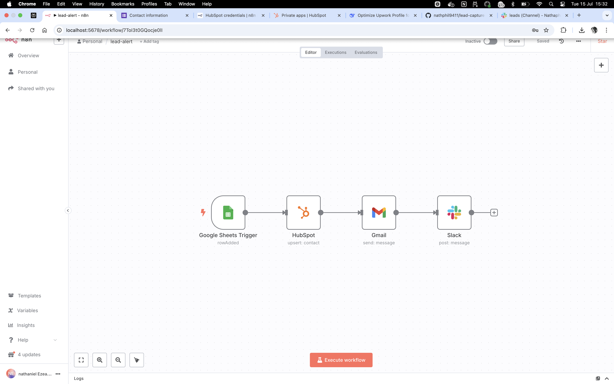

# Lead Capture Automation

Automates processing of Google Form submissions to:
- Create HubSpot contacts
- Send personalized emails
- Post Slack notifications

## ✨ Features
- **100% automated** lead processing
- **Real-time notifications**
- **Zero data entry errors**
- **8+ hours saved weekly**

## 🛠️ Tools Used
| Tool          | Purpose                     |
|---------------|-----------------------------|
| n8n           | Workflow automation         |
| Google Forms  | Lead capture                |
| HubSpot       | CRM integration             |
| Gmail         | Email confirmation          |
| Slack         | Team alerts                 |

## 📽️ Demo

## 🚀 Setup
1. Import `lead_alert.json` into n8n
2. Configure credentials for:
   - Google Sheets
   - HubSpot
   - Gmail
   - Slack
3. Activate workflow

---
*Customizable for any business - [Contact Me](mailto:ezeanakanath@gmail.com)*
